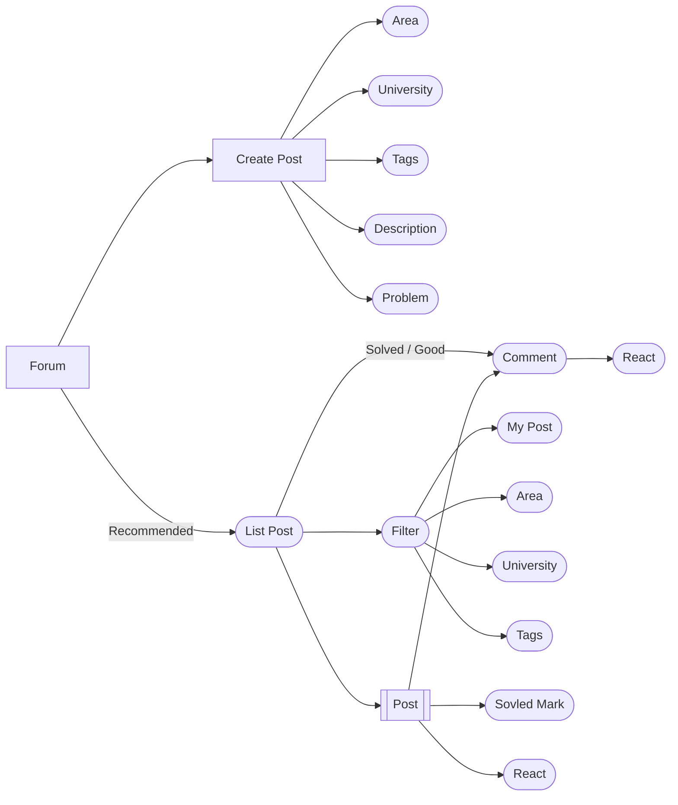
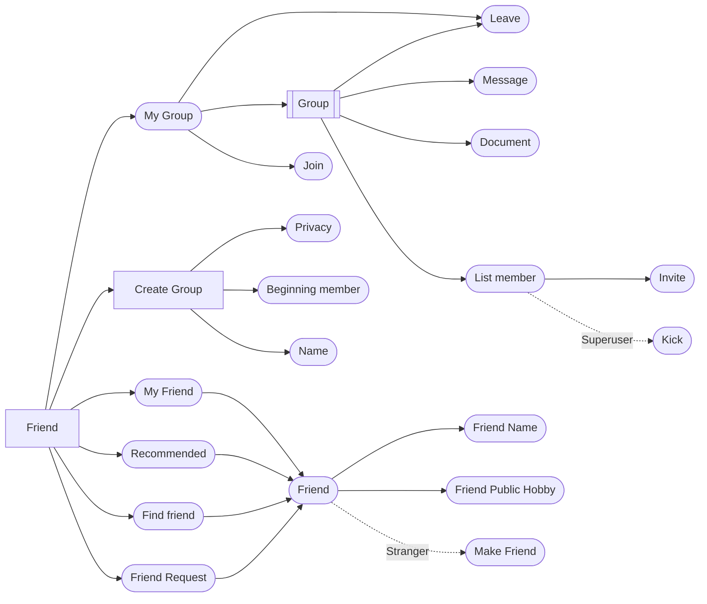
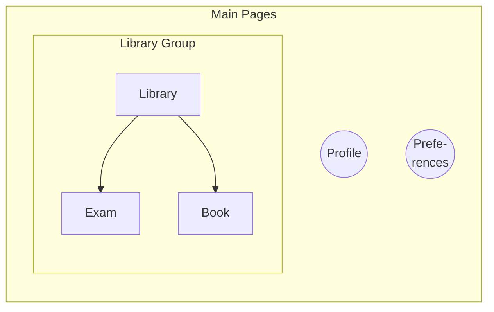
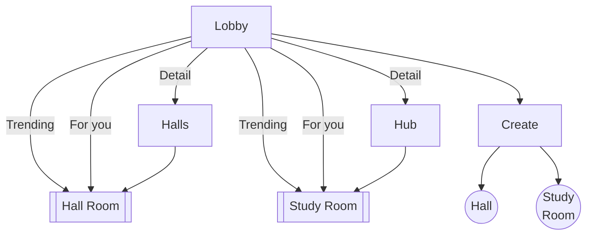

# Feature flow

## Authentication Group

## Forum Group

```mermaid
flowchart LR
			2Forum["Forum"]
			
			2Forum --> 2CreatePost["Create Post"]
			2Forum --> |Recommended| 2ListPost(["List Post"])
			
			2CreatePost --> 21Area(["Area"])
			2CreatePost --> 21Universirty(["University"])
			2CreatePost --> 21Tags(["Tags"])
			2CreatePost --> 21Description(["Description"])
			2CreatePost --> 21Problem(["Problem"])
						
			2ListPost --> |Solved / Good| 2Comment(["Comment"])	
			2ListPost --> 2Filter(["Filter"])
			2ListPost --> 2Post[["Post"]]
			
			2Comment --> 21React(["React"])
			
			2Filter --> 2MyPost(["My Post"])
			2Filter --> 2Area(["Area"])
			2Filter --> 2University(["University"])
			2Filter --> 2Tags(["Tags"])
			
			2Post --> 2Comment
			2Post --> 2Sovled(["Sovled Mark"])
			2Post --> 2Recact(["React"])

	
```

## Friend Group

```mermaid
flowchart LR
		  3Friend["Friend"]
		  3FriendItem(["Friend"])
		  
		  3Friend --> 3MyGroup(["My Group"])
		  3Friend --> 3MyFriend(["My Friend"]) --> 3FriendItem
		  3Friend --> 3RecommendFriend(["Recommended"]) --> 3FriendItem
			3Friend --> 3FindFriend(["Find friend"]) --> 3FriendItem
			3Friend --> 3FriendRequest(["Friend Request"]) --> 3FriendItem
			3Friend --> 3CreateGroup["Create Group"]
			
			3MyGroup --> 3Group[["Group"]]
			3MyGroup --> 3Leave(["Leave"])
			3MyGroup --> 3Join(["Join"])
			
			3Group --> 3Message(["Message"])
			3Group --> 3Document(["Document"])
			3Group --> 3Member(["List member"])
			3Group --> 3Leave
			
			3Member --> 3Invite(["Invite"])
			3Member .-> |Superuser| 3Kick(["Kick"])	
			
			3CreateGroup --> 3Privacy(["Privacy"])
			3CreateGroup --> 3BeginingMembers(["Beginning member"])
			3CreateGroup --> 3GroupName(["Name"])
			
			3FriendItem --> 3FriendName(["Friend Name"])
			3FriendItem --> 3FriendHobby(["Friend Public Hobby"])
			3FriendItem .-> |Stranger| 3MakeFriend(["Make Friend"])
```

## Library Group

```mermaid
flowchart TD

		subgraph MainPages["Main Pages"]
			direction TD
			Profile(("Profile"))
			Preferences(("Prefe-\nrences"))	    
			
					
			subgraph LibraryGroup["Library Group"]
				direction TD
				Library --> Exam["Exam"]
				Library --> Book["Book"]
			end

			
		end
	
```

# Lobby Group

```mermaid
flowchart TD
				direction TD
				Lobby --> |Trending| HallRoom[["Hall Room"]]
				Lobby --> |For you| HallRoom
				Lobby --> |Detail| Halls --> HallRoom
				
				Lobby --> |Trending| StudyRoom[["Study Room"]]
				Lobby --> |For you| StudyRoom
				Lobby --> |Detail| Hub --> StudyRoom
				Lobby --> Create
				
				Create --> HallCreate(("Hall"))
				Create --> StudyCreate(("Study\nRoom"))

```