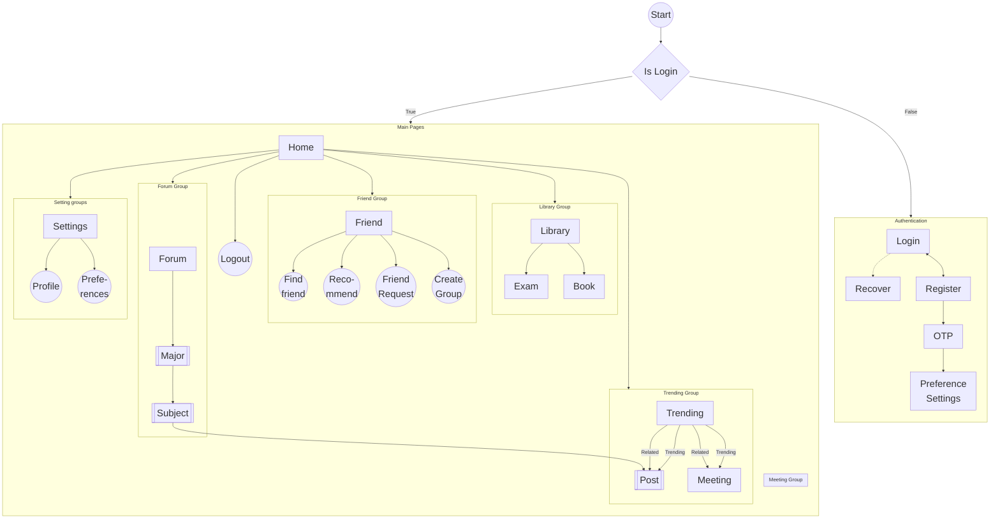

# Screen flow

```mermaid
flowchart TD
    Start(("Start"))
		IsLogin{"Is Login"}
		subgraph MainPages["Main Pages"]
			direction TD
			Profile(("Profile"))
			Preferences(("Prefe-\nrences"))
			
			Post[["Post"]]
			
			subgraph TrendingGroup["Trending Group"]
				direction TD
				Trending --> |Trending| Post
				Trending --> |Related| Post
				Trending --> |Trending| Meeting
				Trending --> |Related| Meeting
			end
			
			subgraph ForumGroup["Forum Group"]
				direction TD
				Forum --> Major[["Major"]]
				Major --> Subject[["Subject"]]
				Subject --> Post
			end
	    
	    subgraph FriendGroup["Friend Group"]
		    direction TD
				Friend --> FindFriendByName(("Find \n friend"))
				Friend --> ReccommendFriend(("Reco-\nmmend"))
				Friend --> FriendRequest(("Friend \n Request"))
				Friend --> CreateGroup(("Create \n Group"))
			end
			
			subgraph MeetingGroup["Meeting Group"]
				direction TD
				
			end
					
	    Home --> TrendingGroup
	    Home --> ForumGroup
	    Home --> FriendGroup
	    Home --> SettingsGroup
	    Home --> LibraryGroup
	    Home --> Logout(("Logout"))
	    
			subgraph LibraryGroup["Library Group"]
				direction TD
				Library --> Exam["Exam"]
				Library --> Book["Book"]
			end
			
			subgraph SettingsGroup["Setting groups"]
				  direction TD
					Settings --> Profile
			    Settings --> Preferences
			 end
			
		end
		subgraph Authentication
			direction TD
			Login["Login"]
			Register["Register"]
			Recover["Recover"]
			Login .-> Recover
			Login <--> Register
			Register --> OTP --> PreferenceSettings["Preference \n Settings"]

		end
	
    Start --> IsLogin
    IsLogin -->|True| MainPages
    IsLogin -->|False| Authentication
    
    classDef default font-size:30px;

```