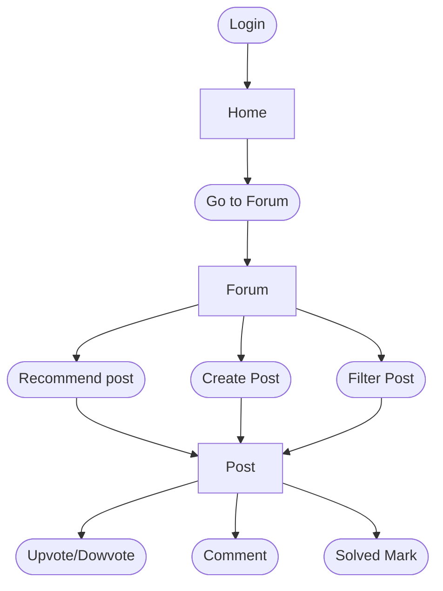
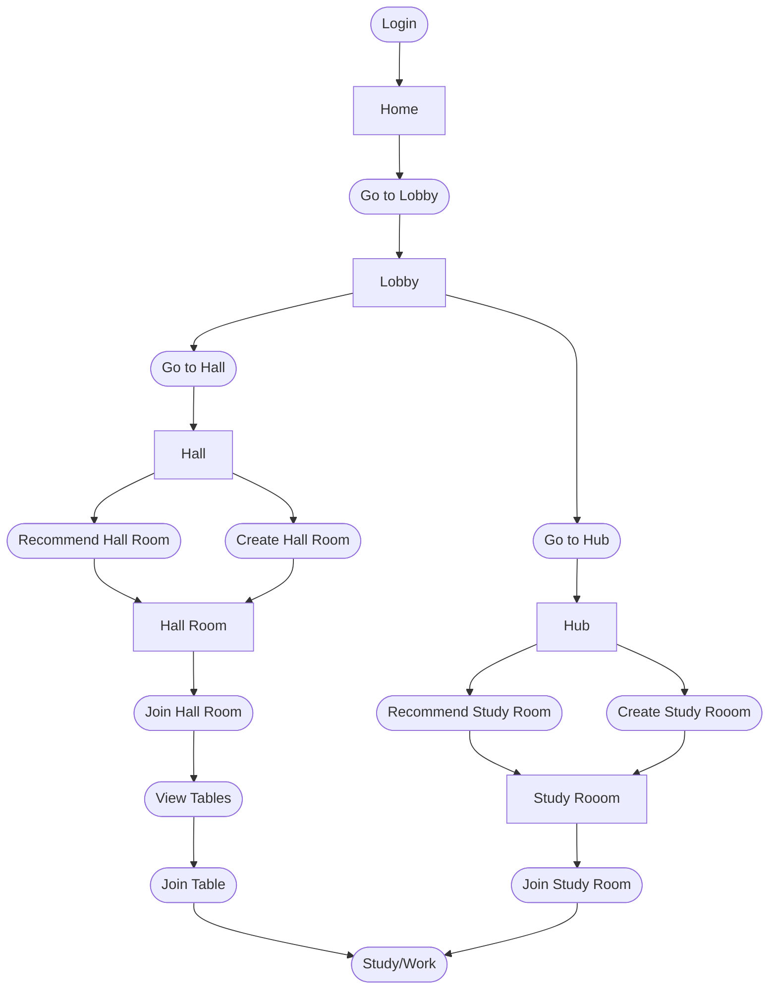
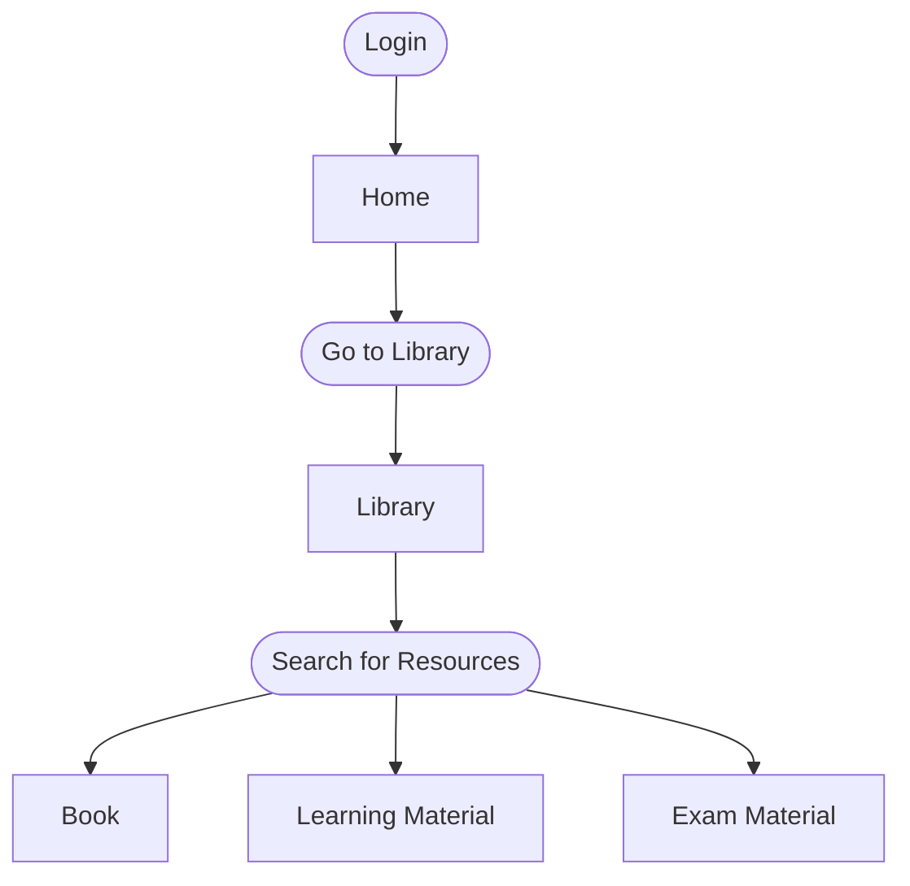

# Post Browsing Workflow

```mermaid
flowchart TD
    Start([Login]) --> A[Home]
    A --> B([Go to Forum])
    B --> C[Forum]
    C --> D([Recommend post])
    D --> E[Post]
    E --> F1([Upvote/Dowvote])
    E --> F2([Comment])
    E --> F3([Solved Mark])
    C --> D1([Create Post])
    D1 --> E
    C --> G([Filter Post])
    G --> E 
```

# Room Workflow

```mermaid
flowchart TD
    Start([Login]) --> A[Home]
    A --> B([Go to Lobby])
    B --> C[Lobby]

    C --> D1([Go to Hall])
    D1 --> E1[Hall]
    E1 --> F11([Recommend Hall Room])
    E1 --> F12([Create Hall Room])
    F11 --> G1[Hall Room]
    F12 --> G1
    G1 --> H1([Join Hall Room])
    H1 --> I1([View Tables])
    I1 --> J1([Join Table])

    C --> D2([Go to Hub])
    D2 --> E2[Hub]
    E2 --> F21([Recommend Study Room])
    E2 --> F22([Create Study Rooom])
    F21 --> G2[Study Rooom]
    F22 --> G2
    G2 --> H2([Join Study Room])
    
    J1 --> K([Study/Work])
    H2 --> K
```

# Library Workflow

```mermaid
flowchart TD
    Start([Login]) --> A[Home]
    A --> B([Go to Library])
    B --> C[Library]
    C --> D([Search for Resources])
    D --> E1[Book]
    D --> E2[Learning Material]
    D --> E3[Exam Material]
```